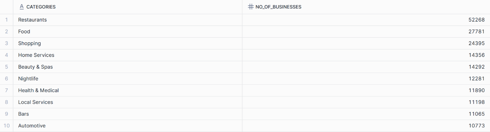
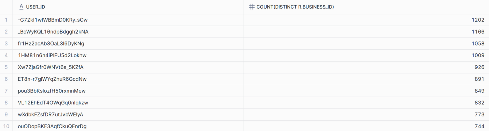
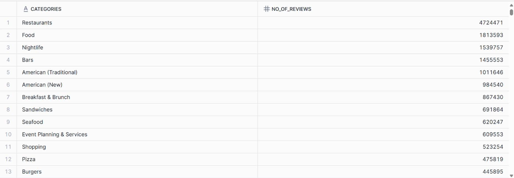
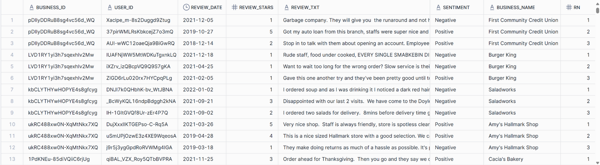
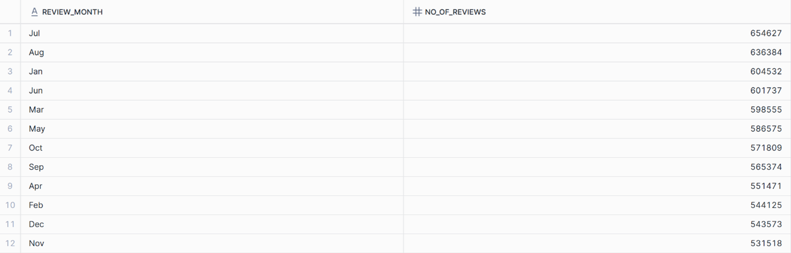
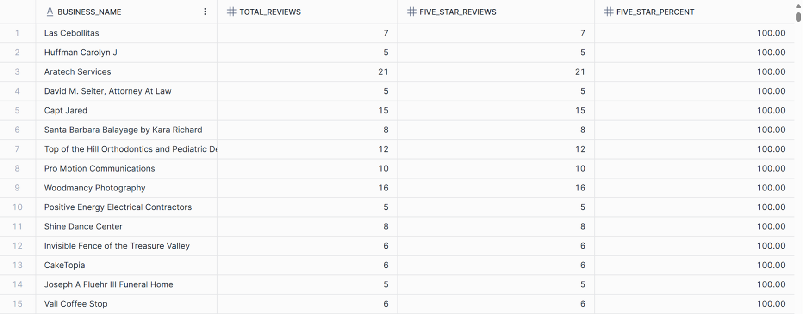
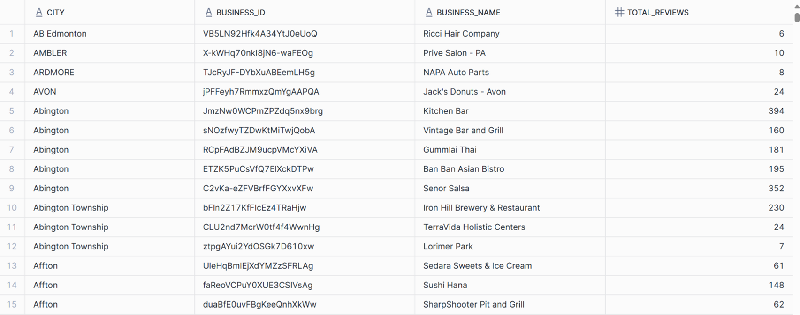
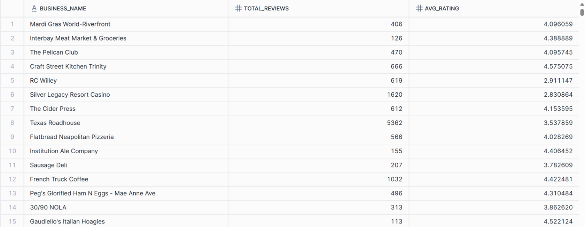
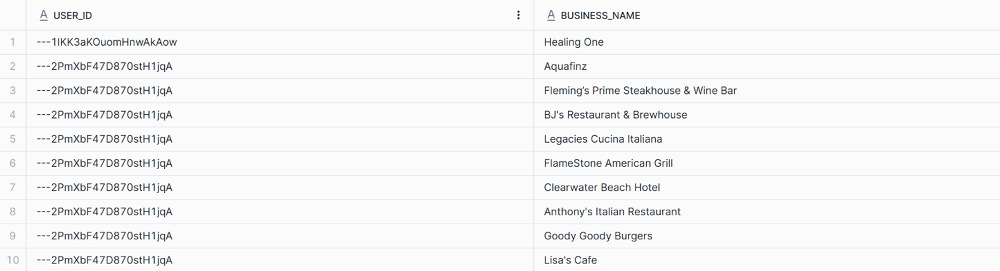
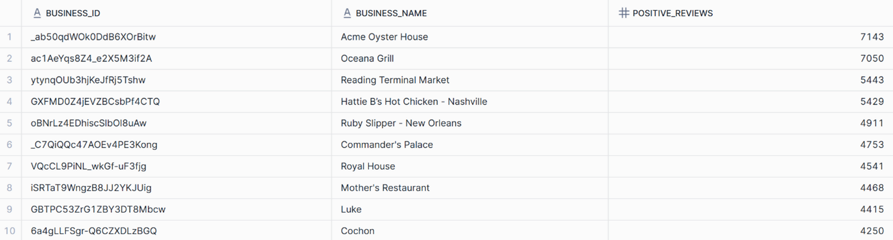

# SQL Analysis Queries – Yelp Reviews Project

This file contains the **10 business analysis queries** executed on Yelp data in Snowflake, along with their respective screenshots.

---

### 1. Number of businesses in each category (Top 10)
```sql
WITH cte AS(
    SELECT business_id, 
        TRIM(A.value) AS categories
    FROM tbl_businesses,
    LATERAL split_to_table(tbl_businesses.categories,',') A
)
SELECT categories, 
    COUNT(*) AS no_of_businesses
FROM cte
GROUP BY categories
ORDER BY no_of_businesses DESC
LIMIT 10;
```
📷 Screenshot:




### 2. Top 10 users who reviewed the most businesses in the "Restaurants" category
```sql
SELECT r.user_id, COUNT(DISTINCT r.business_id)
FROM tbl_businesses b
INNER JOIN tbl_reviews r ON b.business_id = r.business_id
WHERE b.categories ILIKE '%restaurant%'
GROUP BY r.user_id
ORDER BY 2 DESC
LIMIT 10;
```
📷 Screenshot:




### 3. Most popular categories of businesses (based on reviews)
```sql
WITH cte AS (
    SELECT business_id, TRIM(A.value) AS categories
    FROM tbl_businesses,
    LATERAL split_to_table(tbl_businesses.categories, ',') A
)
SELECT cte.categories, COUNT(*) AS no_of_reviews
FROM cte
LEFT JOIN tbl_reviews r ON cte.business_id = r.business_id
GROUP BY 1
ORDER BY no_of_reviews DESC;
```
📷 Screenshot:




### 4. Top 3 most recent reviews for each business
```sql
WITH cte AS (
    SELECT r.*, b.business_name,
           ROW_NUMBER() OVER (PARTITION BY r.business_id ORDER BY review_date DESC) AS rn 
    FROM tbl_businesses b
    LEFT JOIN tbl_reviews r ON b.business_id = r.business_id
)
SELECT * FROM cte
WHERE rn <= 3;
```
📷 Screenshot:




### 5. Month with the highest number of reviews
```sql
SELECT MONTHNAME(review_date) AS review_month,
       COUNT(*) AS no_of_reviews
FROM tbl_reviews
GROUP BY review_month
ORDER BY no_of_reviews DESC;
```
📷 Screenshot:




### 6. Percentage of 5-star reviews per business
```sql
SELECT b.business_name,
       COUNT(*) AS total_reviews,
       SUM(CASE WHEN r.review_stars = 5 THEN 1 ELSE 0 END) AS five_star_reviews,
       ROUND((five_star_reviews/total_reviews)*100, 2) AS five_star_percent
FROM tbl_businesses b
INNER JOIN tbl_reviews r ON b.business_id = r.business_id
GROUP BY 1
ORDER BY five_star_percent DESC;
```
📷 Screenshot:




### 7. Top 5 most reviewed businesses in each city
```sql
WITH cte AS (
    SELECT b.city, b.business_id, b.business_name, COUNT(*) AS total_reviews
    FROM tbl_reviews r
    INNER JOIN tbl_businesses b ON r.business_id = b.business_id
    GROUP BY 1,2,3
)
SELECT *
FROM cte
QUALIFY ROW_NUMBER() OVER (PARTITION BY city ORDER BY total_reviews DESC) <= 5
ORDER BY city ASC;
```
📷 Screenshot:




### 8. Average rating of businesses with at least 100 reviews
```sql
SELECT b.business_name,
       COUNT(*) AS total_reviews,
       AVG(r.review_stars) AS avg_rating
FROM tbl_businesses b
INNER JOIN tbl_reviews r ON b.business_id = r.business_id
GROUP BY 1
HAVING total_reviews >= 100;
```
📷 Screenshot:




### 9. Top 10 users with most reviews and the businesses they reviewed
```sql
WITH cte AS (
    SELECT r.user_id, b.business_name, COUNT(*) AS total_reviews
    FROM tbl_businesses b
    INNER JOIN tbl_reviews r ON b.business_id = r.business_id
    GROUP BY 1,2
    ORDER BY total_reviews DESC
)
SELECT user_id, business_name
FROM cte
WHERE user_id IN (SELECT user_id FROM cte)
GROUP BY 1,2
ORDER BY user_id
LIMIT 10;
```
📷 Screenshot:




### 10. Top 10 businesses with highest positive sentiment reviews
```sql
SELECT b.business_id, b.business_name,
       COUNT(CASE WHEN r.sentiment = 'Positive' THEN 1 ELSE 0 END) AS positive_reviews
FROM tbl_businesses b
INNER JOIN tbl_reviews r ON b.business_id = r.business_id
GROUP BY 1,2
ORDER BY positive_reviews DESC
LIMIT 10;
```
📷 Screenshot:


